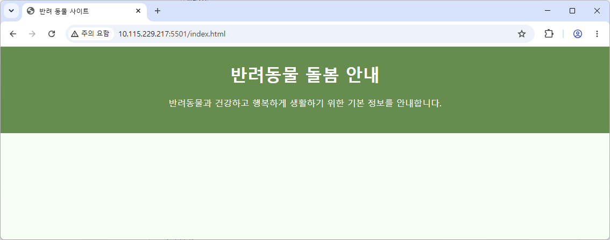

# web-team-project

## 1. 프로젝트 소개 및 설정 이유
이 프로젝트는 HTML, CSS, JavaScript를 활용하여 웹 페이지를 제작하는 팀 협업 실습 프로젝트입니다. 웹 개발의 기본 구성 요소를 학습하고, Git과 GitHub를 이용한 협업 과정을 경험하기 위해 이 주제를 선정하였습니다.

**- 메인 이미지**


## 2. 사용 기술
- HTML5
- CSS3
- Git
- GitHub


## 3. 팀원 역할
| 이름 | 담당 영역 |
|---|---|
| 팀원 1 | Home 콘텐츠 |
| 팀원 2 | 갤러리 콘텐츠 |


## 4. 브랜치 전략
`main` 브랜치는 최종 결과물을 관리하는 브랜치입니다.
각 팀원은 기능별 브랜치를 생성하여 작업합니다.

- 브랜치 이름는 다음과 같습니다.
```
feature/home
feature/gallery
feature/javascript
```
